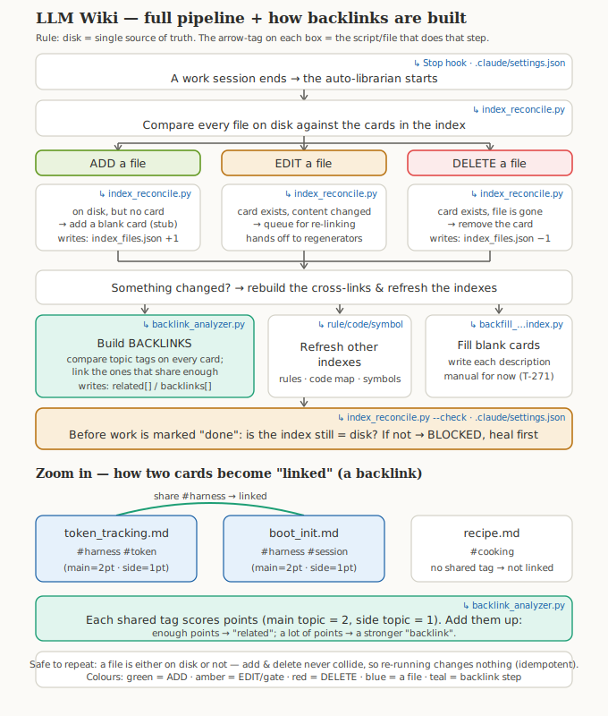

# Wiki Index Sync — Full Lifecycle Guide (ADD / EDIT / DELETE)

> Guide note. Captured 2026-06-24 · **updated 2026-06-25** to match the SHIPPED behavior (T-269 done).
> Visual companion to the integrity audit (knowledge/wiki-index-integrity-audit-2026-06-24.md).
> Purpose: a shared mental model of how the index stays in sync with the real files on every
> add / edit / delete — and why re-running is always safe.

## Diagram

(Source SVG: `knowledge/diagrams/wiki-index-sync-current-vs-fixed.svg` — opens standalone in a browser.)

## The library analogy (the whole system in one picture)
- A **file on disk** = a book on the shelf.
- `index_files.json` = the **card catalog** — one card per book (description · topics · backlinks · references · related).
- `index_reconcile.py` = the **auto-librarian** — it walks the catalog at the end of every work session (the Stop hook).

## The one rule that governs everything
**Disk is the single source of truth.** A file deserves a card *if and only if* the file exists on disk.
Everything else falls out of this one rule:
- on disk but no card → the librarian **enrolls** it (ADD).
- card but no file on disk → the librarian **prunes** it (DELETE).
- These two sets are disjoint by construction (a file is either on disk or not), so the pass is
  **idempotent** — running it again changes nothing. No loops, no double rows.

## The three branches
| Branch | Trigger condition | What the librarian does | File written |
|---|---|---|---|
| **ADD** | indexable file exists on disk (committed OR not) but is missing from the index | auto-insert a **stub** card `{description:"", topics:{major:[],minor:[]}, backlinks:[],references:[],related:[]}`, then run the regenerators | `index_files.json` (+1 row) → `backlink_analyzer.py` |
| **EDIT** | file already has a card; its contents changed | re-run the regenerators — `backlink_analyzer` recomputes `related[]` from topic overlap; rule/code/symbol indexers refresh | `index_files.json` (`related[]` refreshed) + sibling indexes |
| **DELETE** | a card exists but its file is gone from disk | auto-remove the card so no ghost entries remain | `index_files.json` (−1 row) |

## Guardrail: the close-gate
`index_reconcile.py --check` is a read-only pass wired into `.claude/settings.json`. It **blocks writing
`phase: done`** if any on-disk file is still un-indexed or any card is stale → forces a heal first. This is
why DELETE has never leaked: the close is gated.

## Which file does each step (owner map)
The pipeline is not one script — each stage has an owner. Tag from the v2 diagram → responsible file:

| Pipeline step | Owner (script / harness file) |
|---|---|
| "session ends → librarian starts" | the **Stop hook**, declared in `.claude/settings.json` |
| compare disk vs index · ADD enroll · DELETE prune · EDIT queue | `scripts/index_reconcile.py` |
| build cross-links (`related[]` / `backlinks[]`) | `scripts/backlink_analyzer.py` |
| refresh sibling indexes | `scripts/rule_indexer.py` · `scripts/code_graph.py` · `scripts/symbol_indexer.py` |
| fill blank stub descriptions (manual, not auto-wired) | `scripts/backfill_knowledge_index.py` |
| close-gate that blocks `phase: done` | `scripts/index_reconcile.py --check`, wired by `.claude/settings.json` |

`index_reconcile.py` is the conductor: it detects the change, performs ADD/DELETE/EDIT, then *invokes* the
regenerators (it appends `python3 scripts/backlink_analyzer.py` to its regen plan whenever the index was written).

## How backlinks are built (`backlink_analyzer.py`)
Cross-links are computed from **weighted topic overlap**, not from any manual linking:
- Every card carries topics with weights: a **major** topic = 2, a **minor** topic = 1.
- For each pair of cards: `score(A,B) = Σ over shared topics of min(weight_A, weight_B)`.
- `2 ≤ score < 4` → the pair is recorded as **related**; `score ≥ 4` → a stronger **backlink**.
- Legacy flat `topics:[...]` is read as all-minor (weight 1), so score == count of shared topics until re-tagged.
- Input: `knowledge/index_files.json` (+ `knowledge/topic_registry.json` for topic validation). Output: writes
  `related[]` / `backlinks[]` back into `index_files.json`.

Worked example: `token_tracking.md` (#harness, #token) and `boot_init.md` (#harness, #session) share `#harness`
→ they get linked; `recipe.md` (#cooking) shares nothing → it stays unlinked. This is why the EDIT weakness
matters — if a file's topics are not re-extracted after a heavy edit, its links are computed from stale tags.

## Known weakness (deferred)
On EDIT the regenerators rerun, but the file's own `description`/`topics` are **not re-extracted** → if topics
changed a lot, `related[]` can drift (garbage-in). Tracked as T-270. Stub descriptions stay empty until
`backfill_knowledge_index.py` runs — not auto-wired to any hook yet (T-271).

## Scope of the shipped change
- One file edited: `scripts/index_reconcile.py` — added `git_tracked_files()` + `enroll_missing()`; made
  `reconcile()` enroll on-disk-missing files and prune gone files before computing regenerators.
- Result: index went 139 → 208 entries (enroll 71 · prune 2) · idempotent x3 (0/0/0) · `--check` exit 0.
- Tracked under roadmap **T-269 (DONE)**. Secondary hardening still open: T-270 (re-extract topics on edit),
  T-271 (wire backfill into the Stop hook), T-272 (crash guard).

## Related
- knowledge/wiki-index-integrity-audit-2026-06-24.md (full audit + verified root cause)
- scripts/index_reconcile.py (the file the fix edits)
